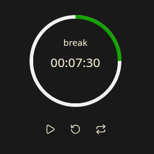

A plugin for Obsidian that offers standard Pomodoro timer features and customization options. Set your own timer modes, their sequence, duration, notification sound, colors, and more.

Includes hideable status bar and panel widgets, as well as Command Palette entries.

Future feature checklist:

- [ ] Separate notification sound for each mode
- [ ] Tasks view
- [ ] Logging
- [ ] More predefined shapes and custom shape support
